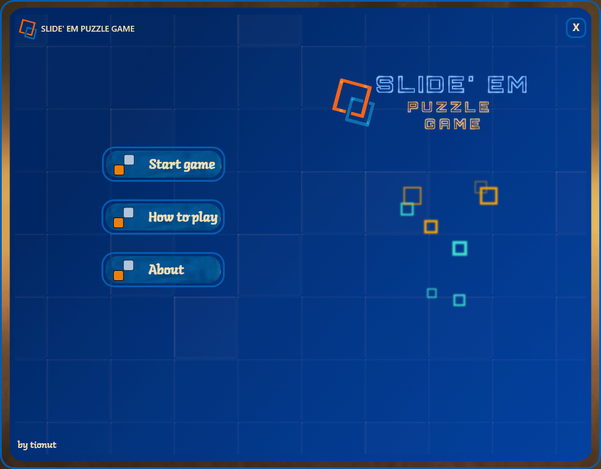

# Slide' Em Puzzle Game

This game is all about puzzles, [15-puzzles](https://en.wikipedia.org/wiki/15_puzzle). The __Slide'Em Puzzle__ is a game that challenges player to slide tiles into the empty space until all the tiles are into  numerical order. The goal is to arrange numbers from a 4 by 4 frame by sliding a numbered tile into the empty space. The fewer moves the more points the player receives after solving the puzzle. With some creativity you even get all three stars. 

One of the interesting feature of the game is the automatic solving of the puzzles. When the player is in trouble, a magical elf will slide the tiles and solve the puzzle for the player.  The real name of magic elf is `IDA* algorithm`, [more info below](#Auto-solving).

The game features multiple levels of difficulties, star ratings, animations and rain of squares.

You can give it a try by download the installer from the [latest release](https://github.com/itivadar/SlideEmPuzzle/releases/download/v1.2final/SlideEmSetup-v1.2-win-x64.exe). Have fun!

##### [You can see more below](#Screenshots)

# Multiple levels of difficulty
There are 3 levels of difficulty in the game: Easy, Medium and Hard. The difficulty depends on how many numbers the player needs to arrange in order to reach the solution.

* __Easy__ would be an 2 by 2 puzzle.
* __Medium__ would be an 3 by 3 puzzle.
* __Hard__ would be an 4 by 4 puzzle.

The player would get a clue about how the puzzle will look when he hovers the mouse over each of the buttons that will select the difficulties.
# Auto-solving 
The automatic solving or the magic solving of the puzzle is trigger by the button _"Find path"_ button. The game will start sliding the tiles until the goal position is reached. The animations are smooth so the player can easily watch them. The algorithm developed to solve the puzzle is called `Iterative deepening A*` ( [IDA*](https://en.wikipedia.org/wiki/Iterative_deepening_A*) ). The `IDA*` algorithm is a graph search algorithm which find the shortest path between  a start node and a end node. It is a depth-first algorithm which uses an heuristic function to evaluate the remaining nodes. The graph is build starting from the puzzle which needs to be solved. The starting board would be the starting node of the graph. The destination node is the goal position of the graph.

An example of starting node:
|   |   |   | 
|-- |-- | --|
| 7 | 1 | 3 |
| 4 |   | 8 |
| 6 | 5 | 2 |

For a 3 by 3 puzzle the end node is defined as: 

|   |   |   | 
|-- |-- | --|
| 1 | 2 | 3 |
| 4 | 5 | 6 |
| 7 | 8 |  |

The algorithm will start at the node with the puzzle to solved and it will search for the goal node. It will evaluate each neighbours of the current node. When the goal is reached, the solution is reconstructed and smoothly played to the player. 

This algorithm works well for smaller puzzle but for 4 by 4 puzzles it will need a good heuristic function in order to solve a puzzle in time without getting the player bored.

The heuristic function for evaluating nodes in 4 by 4 puzzles destination is `5-5-5 Database pattern`. This function should estimates how "close" is a node from the destination node. The board is divided in 3 areas of 5 tiles and these areas are solved and stored individually. The costs for these 5-5-5 patterns are calculated using breath-first algorithm.

# Score system
The points awarded to a user have two components: the slides component and the time components. 

The most important component is the slides component. The player will get the maximum points for this component by making minimum slides (moves) required to solve a certain puzzle.

An exponential function gives the amount of points for this component. It is based on the difference between slides made by the player and minimum slides required.

For the time component, the player will get some extra points for how fast he will solve the puzzle. 
Based on the points and the difficulty level, the player is awarded between no star and three stars.
No star is awarded if the magical elf is summoned to solve the puzzles.
# Screenshots

